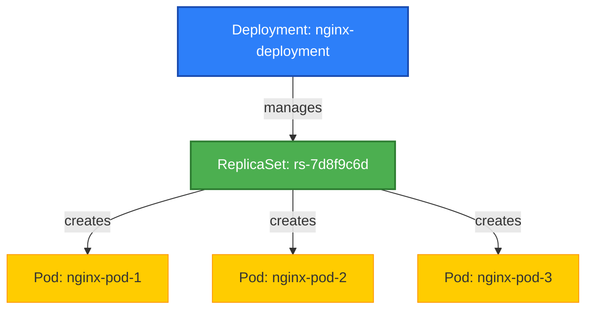

## نظرة عامة على الوحدة


###  ماذا سنتعلم في هذه الوحدة؟

- ما هو الـ **ReplicaSet** ولماذا يُستخدم.
- كيف يعمل **Deployment** لإدارة التكرار والتحديث.
- متى نستخدم **DaemonSet** لتشغيل Pod على كل عقدة.
- الفرق بين **StatefulSet** و Deployment، ومتى نحتاج إلى إدارة الحالة.
- كيفية تنفيذ المهام المؤقتة والمجدولة باستخدام **Jobs** و **CronJobs**.
- مفاهيم عملية ونصائح تصميم هذه الموارد بكفاءة.


## شرح مورد الـ Deployment في Kubernetes


###  ما هو الـ Deployment؟


الـ **Deployment** هو مورد (Resource) في Kubernetes يُستخدم لإدارة **Pods** وتحديثها ومراقبتها بشكل آمن ومستقر.

تستطيع من خلال الـ Deployment أن:

- تُنشئ نسخة واحدة أو عدة نسخ (Replicas) من تطبيقك.
- تُحدث صورة التطبيق (Image) بسلاسة دون توقف.
- تراقب حالة التطبيق وتتأكد أن عدد النسخ دائمًا كما حددته.
- تعود للنسخة السابقة (Rollback) في حال فشل التحديث.

###  لماذا نحتاج إلى Deployment؟

تخيل أن لديك تطبيق يعمل في Pod واحدة…  
ماذا لو تعطل هذا الـ Pod؟ التطبيق سيتوقف!

الحل؟ نستخدم **Deployment**، الذي يُنشئ **ReplicaSet** لإدارة **عدة Pods**، بحيث يضمن لك دائمًا عددًا معينًا من النسخ تعمل باستمرار.

Deployment = التكرار + التحديث + الاستقرار  
وهذا بالضبط ما نحتاجه في بيئة الإنتاج.


###  كيف يعمل الـ Deployment؟

سلسلة التنفيذ كالآتي:

**Deployment → ReplicaSet → Pods**

- الـ Deployment ينشئ ReplicaSet.
- ReplicaSet ينشئ ويُدير عددًا من الـ Pods.
- إذا سقط أحد الـ Pods، يقوم ReplicaSet بإنشاء آخر فورًا.
- وإذا أردنا تحديث النسخة؟ يقوم Deployment بإدارة التحديث بطريقة تدريجية وآمنة (Rolling Update).


### 📄 مثال عملي: ملف YAML

```yaml
apiVersion: apps/v1
kind: Deployment
metadata:
  name: nginx-deployment
spec:
  replicas: 3
  selector:
    matchLabels:
      app: nginx
  template:
    metadata:
      labels:
        app: nginx
    spec:
      containers:
      - name: nginx
        image: nginx:1.25
        ports:
        - containerPort: 80

```

### أوامر عملية
```bash
kubectl apply -f nginx-deployment.yaml
kubectl get deployments
kubectl get pods -l app=nginx
kubectl scale deployment nginx-deployment --replicas=5
```
## ReplicaSet


الـ **ReplicaSet** هو أحد الموارد (Resources) في Kubernetes، ومهمته الأساسية هي:

>  **ضمان عدد ثابت من الـ Pods تعمل دائمًا في الكلاستر.**


###  تعريف بسيط:

> الـ **ReplicaSet** = مورد يُستخدم للتأكد أن هناك دائمًا **N عدد من الـ Pods** تعمل، وإذا توقف أي منها… Kubernetes يُنشئ تلقائيًا بديلًا لها.


###  ماذا يفعل ReplicaSet تحديدًا؟

- تكتب في ملف الـ ReplicaSet أنك تريد مثلاً 3 نسخ من Pod معيّن.
- Kubernetes يقوم بإنشاء 3 نسخ (Pods) من هذا النوع.
- إذا تعطل أحدها أو حُذف، يقوم تلقائيًا بإنشاء نسخة جديدة.
- وإذا زاد العدد لأي سبب، يقوم بحذف الزائد ليعود للعدد المطلوب.


###  مكونات ملف ReplicaSet

```yaml
apiVersion: apps/v1
kind: ReplicaSet
metadata:
  name: my-replicaset
spec:
  replicas: 3
  selector:
    matchLabels:
      app: web
  template:
    metadata:
      labels:
        app: web
    spec:
      containers:
      - name: nginx
        image: nginx:1.25
```

####  شرح الحقول:

- `replicas`: عدد الـ Pods المطلوب.
- `selector`: كيف يعرف الـ ReplicaSet أي Pods يدير (باستخدام Label).
- `template`: شكل الـ Pod الذي يجب إنشاؤه.


###  هل نحتاج استخدام ReplicaSet يدويًا؟

**غالبًا لا.**  
لأن مورد **Deployment** يستخدم ReplicaSet داخليًا لإدارة الـ Pods.

> لذلك من الأفضل استخدام Deployment، إلا إذا كنت في سيناريو خاص يتطلب التحكم المباشر في ReplicaSet.


###  الخلاصة:

| الخاصية              | القيمة                             |
|----------------------|------------------------------------|
| ما هو؟               | مورد لإدارة عدد ثابت من الـ Pods   |
| ميزته الأساسية       | الحفاظ على عدد محدد دائمًا         |
| يستخدمه مَن؟         | يستخدمه الـ Deployment داخليًا     |
| هل أستخدمه يدويًا؟   | نادرًا، Deployment هو الخيار الأفضل |


## DaemonSet


### المفهوم العام

`DaemonSet` هو نوع من الموارد في Kubernetes يُستخدم لضمان تشغيل **Pod واحد على كل عقدة** (Node) في الكلاستر — أو على مجموعة محددة من العقد إذا تم تحديد ذلك.

الغرض الأساسي من DaemonSet هو **تشغيل الخدمات التي يجب أن تكون موجودة على كل عقدة**، مثل:

- أدوات المراقبة (Monitoring agents) مثل `Prometheus Node Exporter`.
- أدوات تسجيل السجلات (Log collectors) مثل `Fluentd`, `Logstash`.
- أدوات الشبكات أو التخزين التي تعمل محليًا على كل Node.


### متى نستخدم DaemonSet؟

- عندما تحتاج إلى تشغيل خدمة معينة على كل Node في الكلاستر.
- عندما تحتاج إلى جمع بيانات من كل عقدة (مثل Logs أو Metrics).
- لتثبيت برامج تعمل على مستوى النظام.


### بنية ملف YAML لـ DaemonSet

```yaml
apiVersion: apps/v1
kind: DaemonSet
metadata:
  name: node-exporter
spec:
  selector:
    matchLabels:
      app: node-exporter
  template:
    metadata:
      labels:
        app: node-exporter
    spec:
      containers:
      - name: node-exporter
        image: prom/node-exporter
        ports:
        - containerPort: 9100
```

#### شرح الملف:

- `kind: DaemonSet`: نوع المورد.
- `selector`: يحدد الـ Pods التي يديرها هذا الـ DaemonSet.
- `template`: نموذج الـ Pod الذي سيتم تشغيله على كل Node.
- `image`: صورة الحاوية، في هذا المثال نستخدم `prom/node-exporter`.


### أوامر مهمة

```bash
kubectl get daemonsets
kubectl describe daemonset <name>
kubectl delete daemonset <name>
```


### أهم الخصائص

- DaemonSet يعمل تلقائيًا على كل Node حالي وجديد (إلا إذا تم استبعاده بتوليريشن أو سلكتر).
- عندما تُزال عقدة، تُزال الـ Pod التابعة لها تلقائيًا.
- يمكنك تخصيص أي Node تريد تشغيل DaemonSet عليه باستخدام:
  - `nodeSelector`
  - `affinity`
  - `tolerations`

### ملحوظات

- إذا كان هناك أكثر من Pod من نفس النوع على نفس Node، فربما لا تحتاج DaemonSet.
- لا يُستخدم لتوزيع الحِمل، بل لتوفير نسخة واحدة على كل Node.
- يمكن الجمع بين `DaemonSet` و `Taints/Tolerations` لضبط العمل على أنواع معينة من العقد.
## StatefulSet


`StatefulSet` هو نوع من موارد Kubernetes يستخدم لإدارة **نشر وإدارة التطبيقات ذات الحالة (Stateful Applications)** مثل قواعد البيانات (MongoDB, MySQL, Cassandra...) أو أي تطبيق يحتاج إلى هوية ثابتة وتخزين دائم.

يُستخدم `StatefulSet` عندما:
- تحتاج الـ Pod إلى **اسم ثابت**.
- تحتاج إلى **تخزين دائم** مرتبط باسم Pod.
- يجب أن يتم **تشغيل أو إيقاف الـ Pods بترتيب معين**.
- كل Pod يجب أن يكون **فريدًا وله هوية**.


###  الفرق بين StatefulSet و Deployment

| العنصر              | Deployment                 | StatefulSet                      |
|---------------------|----------------------------|----------------------------------|
| أسماء الـ Pods      | عشوائية                    | ثابتة ومتسلسلة (pod-0, pod-1...) |
| التخزين             | مشترك أو مؤقت              | تخزين دائم فريد لكل Pod         |
| الترتيب             | غير مهم                     | يتم التشغيل/الإيقاف بترتيب محدد |
| الاستخدام الشائع     | تطبيقات لا تحتاج لحالة      | قواعد بيانات، تطبيقات تعتمد على التخزين |


###  مكونات مهمة في StatefulSet

- **serviceName**: يجب إنشاء `Headless Service` لكي تعمل الـ StatefulSet بشكل صحيح.
- **volumeClaimTemplates**: يُستخدم لإنشاء PVC فريد لكل Pod.
- **podManagementPolicy**: التحكم في ترتيب التشغيل (افتراضيًا `OrderedReady`).
- **persistentVolume**: كل Pod يحصل على تخزين دائم خاص به.


###  مثال YAML

```yaml
apiVersion: apps/v1
kind: StatefulSet
metadata:
  name: web
spec:
  serviceName: "web"
  replicas: 3
  selector:
    matchLabels:
      app: web
  template:
    metadata:
      labels:
        app: web
    spec:
      containers:
      - name: nginx
        image: nginx:1.25
        volumeMounts:
        - name: www
          mountPath: /usr/share/nginx/html
  volumeClaimTemplates:
  - metadata:
      name: www
    spec:
      accessModes: [ "ReadWriteOnce" ]
      resources:
        requests:
          storage: 1Gi
```


###  العرض العملي

1. إنشاء Headless Service:
```bash
kubectl apply -f headless-service.yaml
```

2. تطبيق StatefulSet:
```bash
kubectl apply -f statefulset.yaml
```

3. التحقق من الـ Pods:
```bash
kubectl get pods -l app=web
```

4. التحقق من PVC لكل Pod:
```bash
kubectl get pvc
```


###  متى تستخدم StatefulSet؟

- عندما تحتاج كل Pod لهوية فريدة (اسم DNS).
- عند الحاجة لتخزين دائم منفصل لكل Pod.
- عندما يتطلب التطبيق الترتيب في التشغيل/الإيقاف.
- في حالات مثل: قواعد البيانات، أنظمة المراسلة (Kafka, RabbitMQ).


###  ممارسات جيدة

- لا تستخدم StatefulSet إن لم تكن بحاجة حقيقية لهوية ثابتة أو تخزين منفصل.
- تأكد من أن StorageClass تدعم `Dynamic Provisioning`.
- احرص على اختبار سيناريوهات الإيقاف والتحديث بعناية.


## Jobs


###  التعريف
`Job` هو نوع من الموارد في Kubernetes يُستخدم لتنفيذ **مهمة واحدة (Task) تنتهي** بعد إتمام عملها بنجاح.

بمعنى آخر، إذا كان لديك برنامج أو سكربت يجب أن يُشغّل **مرة واحدة فقط** (أو عدد معين من المرات) ثم يتوقف بعد الانتهاء، فالـ Job هو الأداة المثالية لذلك.


###  الفرق بين Pod و Job
| المقارنة       | Pod                  | Job                                    |
|----------------|----------------------|----------------------------------------|
| التشغيل        | يبقى يعمل دائمًا     | يُشغّل حتى الانتهاء ثم يتوقف          |
| حالات الاستخدام | تطبيقات مستمرة       | مهام مؤقتة أو معالجة دفعة (batch)     |
| التكرار        | لا يدعم               | يدعم التكرار/الإعادة عند الفشل        |


###  أمثلة عملية لاستخدام Job
- سكربت لترحيل قاعدة بيانات.
- مهمة نسخ بيانات من موقع إلى آخر.
- إرسال تقرير يومي أو إشعار.
- تصدير بيانات في نهاية اليوم.


### 📄 مثال على تعريف Job

```yaml
apiVersion: batch/v1
kind: Job
metadata:
  name: hello-job
spec:
  template:
    spec:
      containers:
      - name: hello
        image: busybox
        command: ["echo", "Hello from Kubernetes Job!"]
      restartPolicy: Never
```

📝 هذا المثال يُشغّل Pod ينفّذ أمر `echo` ثم ينتهي.


###  التحكم في عدد المحاولات
```yaml
spec:
  backoffLimit: 4  # عدد مرات إعادة المحاولة عند الفشل (الافتراضي 6)
```


###  تشغيل المهمة أكثر من مرة
يمكن استخدام `completions` و `parallelism`:

```yaml
spec:
  completions: 5     # عدد مرات تنفيذ المهمة بنجاح
  parallelism: 2     # عدد المهام التي تعمل في نفس الوقت
```


###  إدارة المهام المجدولة (CronJob)
إذا أردت تشغيل المهمة بانتظام (مثلًا يوميًا أو كل ساعة)، استخدم `CronJob` بدلًا من `Job`.


###  أوامر مفيدة مع Job
```bash
kubectl get jobs
kubectl describe job hello-job
kubectl get pods --selector=job-name=hello-job
kubectl logs <pod-name>
```


###  الخلاصة
- `Job` يُستخدم للمهام المؤقتة التي تنفذ مرة واحدة أو عدة مرات.
- مثالي لمعالجة دفعات البيانات، التهيئة، المهام الخلفية.
- يمكن تكرار المهمة تلقائيًا عند الفشل أو تشغيلها بشكل متوازي.


##  CronJobs

### ما هو CronJob؟

`CronJob` هو نوع خاص من الموارد في Kubernetes يُستخدم لتشغيل الوظائف (Jobs) تلقائيًا وفقًا لجدول زمني محدد، تمامًا مثل الـ `cron` في أنظمة Linux.

يُستخدم لتشغيل المهام المتكررة مثل:

- النسخ الاحتياطي (Backup).
- إرسال تقارير يومية.
- تنظيف ملفات مؤقتة أو غير مستخدمة.
- مزامنة البيانات مع أنظمة خارجية.


###  الفرق بين Job و CronJob

| Job | CronJob |
|-----|---------|
| يُشغّل مرة واحدة عند إنشائه. | يُشغّل بشكل دوري حسب جدول زمني. |
| يُستخدم لمهام لمرة واحدة. | يُستخدم لمهام متكررة. |
| لا يحتوي على جدول زمني. | يعتمد على جدول `cron` (مثال: كل يوم، كل ساعة…). |


###  مثال على CronJob

```yaml
apiVersion: batch/v1
kind: CronJob
metadata:
  name: hello-cron
spec:
  schedule: "*/1 * * * *"  # كل دقيقة
  jobTemplate:
    spec:
      template:
        spec:
          containers:
          - name: hello
            image: busybox
            args:
            - /bin/sh
            - -c
            - date; echo "Hello from CronJob"
          restartPolicy: OnFailure
```

####  الشرح:
- `schedule`: يحدد جدول التنفيذ باستخدام صيغة `cron`.
- `jobTemplate`: يحدد مواصفات الـ Job الذي سيتم تشغيله في كل مرة.
- `restartPolicy`: يحدد سياسة إعادة التشغيل، وعادة ما تكون `OnFailure`.


###  فهم صيغة الـ Cron

صيغة الـ cron تتكون من 5 أجزاء:

```bash
# ┌──────────── دقيقة (0 - 59)
# │ ┌────────── ساعة (0 - 23)
# │ │ ┌──────── يوم من الشهر (1 - 31)
# │ │ │ ┌────── شهر (1 - 12)
# │ │ │ │ ┌──── يوم من الأسبوع (0 - 6) (الأحد = 0)
# │ │ │ │ │
# * * * * *
```

https://crontab.guru/

#### أمثلة:

- `"*/5 * * * *"` → كل 5 دقائق.
- `"0 0 * * *"` → يوميًا الساعة 12 منتصف الليل.


###  أوامر مهمة

```bash
kubectl get cronjobs
kubectl describe cronjob hello-cron
kubectl get jobs --watch  # لرؤية الوظائف التي تم إنشاؤها
```


###  ملحوظات مهمة

- يتم إنشاء Job جديد في كل مرة ينفذ فيها الـ CronJob.
- إذا تأخرت مهمة ما، Kubernetes قد يتجاهلها أو ينفذها حسب الإعدادات.
- يمكنك استخدام `startingDeadlineSeconds`, `concurrencyPolicy`, `successfulJobsHistoryLimit` لمزيد من التحكم.


###  الخلاصة

- CronJob = Job مجدول.
- مفيد جدًا لتشغيل المهام المتكررة.
- يعتمد على تنسيق cron.
- يجب مراقبة الأداء وعدد الوظائف المُنتَجة لتجنب التحميل الزائد على الكلاستر.


## 📚 مصادر خطة الدراسة - الفصل 6: موارد تشغيل التطبيقات (Workload Resources)

### 🔹 ReplicaSet
- <a href="https://kubernetes.io/docs/concepts/workloads/controllers/replicaset/" target="_blank">📖 المفاهيم الأساسية: ReplicaSet</a>  
- <a href="https://kubernetes.io/docs/tasks/run-application/scale-stateful-set/" target="_blank">📖 كيفية التحكم في عدد الـ Replicas</a>  
- <a href="https://www.youtube.com/watch?v=rDCWxkvPlAw" target="_blank">🎥 فيديو: Kubernetes ReplicaSet Explained</a>  

### 🔹 Deployments
- <a href="https://kubernetes.io/docs/concepts/workloads/controllers/deployment/" target="_blank">📖 المفاهيم الأساسية: Deployments</a>  
- <a href="https://kubernetes.io/docs/tutorials/kubernetes-basics/deploy-app/deploy-intro/" target="_blank">📖 نشر التطبيقات باستخدام Deployments</a>  
- <a href="https://www.youtube.com/watch?v=s_o8dwzRlu4" target="_blank">🎥 فيديو: Kubernetes Deployments Simplified</a>  

### 🔹 DaemonSet
- <a href="https://kubernetes.io/docs/concepts/workloads/controllers/daemonset/" target="_blank">📖 المفاهيم الأساسية: DaemonSet</a>  
- <a href="https://www.youtube.com/watch?v=Uj9J6wdR0LU" target="_blank">🎥 فيديو: DaemonSets in Kubernetes</a>  

### 🔹 StatefulSet
- <a href="https://kubernetes.io/docs/concepts/workloads/controllers/statefulset/" target="_blank">📖 المفاهيم الأساسية: StatefulSet</a>  
- <a href="https://kubernetes.io/docs/tutorials/stateful-application/basic-stateful-set/" target="_blank">📖 تشغيل تطبيقات Stateful على Kubernetes</a>  
- <a href="https://www.youtube.com/watch?v=pPQKAR1pA9U" target="_blank">🎥 فيديو: Kubernetes StatefulSets Explained</a>  

### 🔹 Jobs & CronJobs
- <a href="https://kubernetes.io/docs/concepts/workloads/controllers/job/" target="_blank">📖 المفاهيم الأساسية: Job</a>  
- <a href="https://kubernetes.io/docs/concepts/workloads/controllers/cron-jobs/" target="_blank">📖 المفاهيم الأساسية: CronJob</a>  
- <a href="https://kubernetes.io/docs/tasks/job/automated-tasks-with-cron-jobs/" target="_blank">📖 تشغيل المهام المجدولة باستخدام CronJobs</a>  
- <a href="https://www.youtube.com/watch?v=9n9N2mY2h2M" target="_blank">🎥 فيديو: Kubernetes Jobs & CronJobs Explained</a>  

---

✅ هذه المصادر ستساعدك على:  
1. فهم الفرق بين **ReplicaSet** و **Deployment** ولماذا نحتاج الاثنين.  
2. معرفة دور **DaemonSet** في تشغيل الـ Pods على كل Node.  
3. إدارة التطبيقات ذات الحالة (**Stateful Applications**) باستخدام **StatefulSet**.  
4. تشغيل المهام لمرة واحدة (**Jobs**) أو بشكل مجدول (**CronJobs**).  
5. ربط المفاهيم بالنشر العملي باستخدام **kubectl**.  

